# cb-privacy
一个基于区块链+同态加密+小程序的隐私保护方案

### :tada: 开发

- 在本地创建一个存放projects的文件夹，比如projects，在该文件夹下右键，点击`Git bash here`
- 输入 `git clone https://github.com/yenche123/cb-privacy.git ` 安装好后projects下会出现 `cb-privacy` 文件夹。

### :file_folder: cb-privacy下 各文件夹解释

`contracts`: 存放智能合约

`main-project`: 主要目录，终端层、数据分析者（外包）以及边缘服务器层的代码皆在其中。

### :file_folder: main-project 下 文件夹解释

`cloudfunctions`: 云函数根目录，其下每个文件夹对应一个云函数。其中`cb` 为中枢区块链的代理，`edgeServer` 模拟边缘服务器，`getOpenId` 为获取身份标识用的云函数。

`miniprogram`: 小程序客户端的根目录

`project.config.json`: 小程序项目配置文件

### :hammer: main-project 的部署

- 安装 [小程序开发者工具](https://developers.weixin.qq.com/miniprogram/dev/devtools/download.html)
- [注册一个小程序账号](https://mp.weixin.qq.com/wxopen/waregister?action=step1&token=&lang=zh_CN)，申请完成后，获得小程序的 AppID 
- 打开小程序开发者工具，选择导入项目`projects/main-project`，输入AppID。由于会使用到云开发，所以建议申请一个AppID，不要使用测试号。接着，为项目命名，输入“项目名称”，然后点击 `导入` 

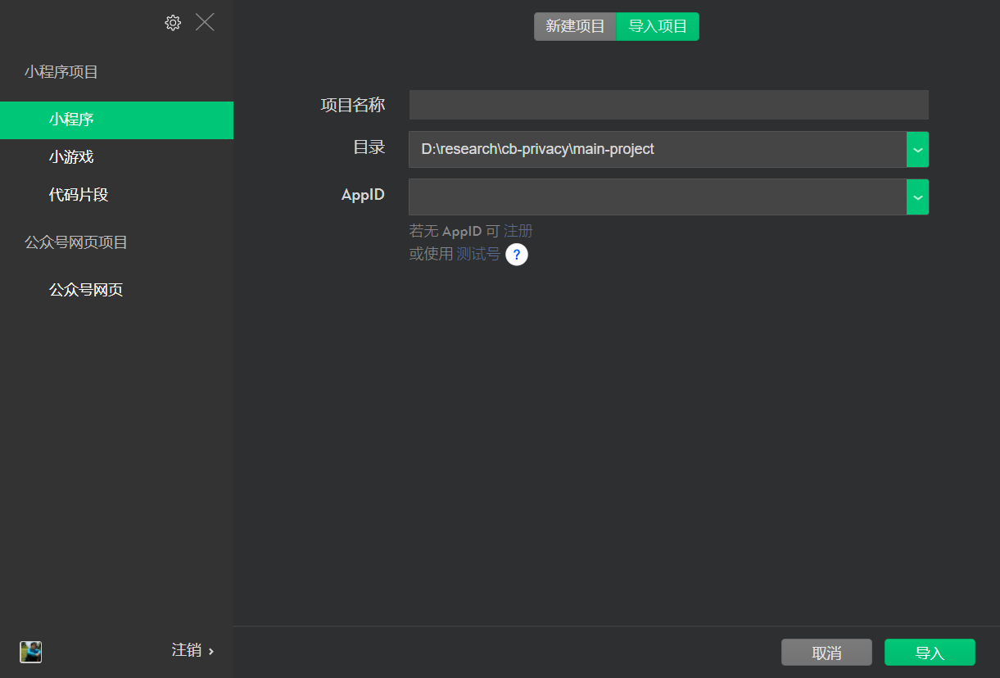

p.s. 注意上图的目录 `D:\research` 只是示例，请选择你中你本地的 `cb-privacy/main-project` 文件夹

- 点击导入后，若没有开通云开发（用于部署云函数和存储其他部署存于链上的数据），点击顶部选项栏的`云开发`，进行开通

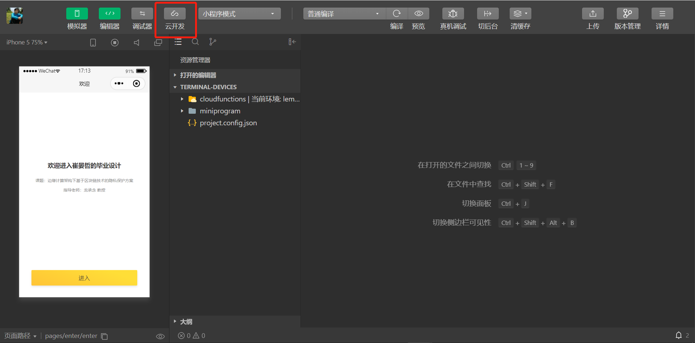

- 打开 `cloudfunctions/cb`文件夹里，打开终端命令行，分次输入 `npm install big-integer@1.6.48` 、`npm install ethereumjs-tx@2.1.2` 、`npm install web3@0.20.6` 以及 `npm install web3-eth-abi` 。@之后的版本号，代表安装特定版本，这些版本皆已通过测试，若为其他（或最新）版本，不保证兼容。完成后，在小程序开发者工具里，找到cloudfunctions/cb 目录，在该目录上右键，点击`上传并部署：云端安装依赖（不上传node modules），如此即可同步云函数至云上。

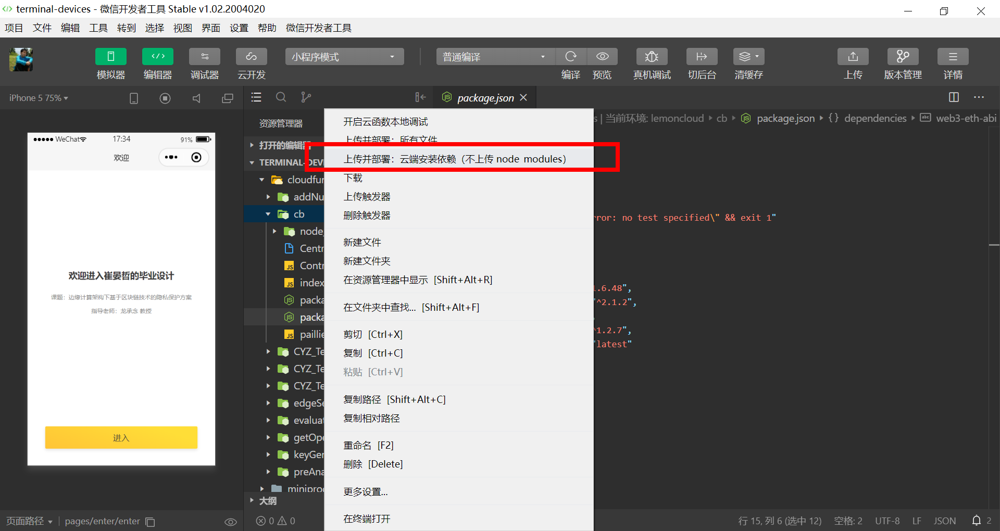

- 同理，对`edgeServer` 云函数安装  `npm install big-integer@1.6.48` ，安装完也同样`上传并部署：于端安装依赖`
- 在终端打开 cb-privacy/main-project/miniprogram ，`npm install big-integer@1.6.48` 在终端层上安装大数模块。安装好后，点击 小程序开发者工具 顶部标签 `工具` ，再点击 `构建 npm`，即把npm模块转成小程序客户端可运行的格式。转换完毕后，miniprogram 文件夹下即会出现 `miniprogram_npm` 文件夹，这里存放转成完成的代码。
- 至此，即完成配置

### :smirk: 如何使用

- 首先，打开小程序，点击`进入`

 

- 接着点击`数据分析者`，输入分析标题和详情

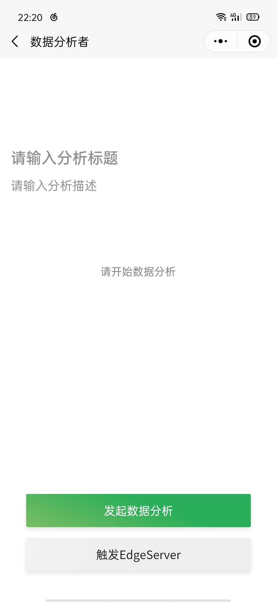

 

- 回到身份选择页，选择`终端用户`，输入一个数字；输入完，退出到选择页再进入，接着再输入一个数字，如此反复.....

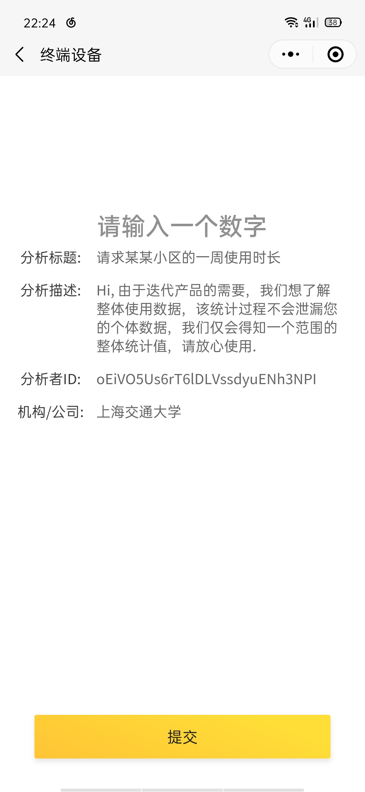

- 最后再回到数据分析者页，`触发EdgeServer`，观察结果。

 

至此，即完成了系统的初探。

以下步骤为智能合约开发及部署的流程，若只是简单上手本方案，可忽略。

### :pencil: 开发智能合约

使用任意代码编辑器（譬如VS code）打开，cb-privacy/contracts 目录，其中以存放一个.sol后缀的文件 `CentralBlockchain.sol` 文件，这即是一个智能合约的代码。目前该智能合约已部署在 Ropsten 测试链上，合约地址为 `0x19987BDd141D1F6F582E90C2f35aF43620A93FDc` 

现在若我们修改或新增了智能合约，可以打开 [在线remix ide](http://remix.ethereum.org/) 对合约进行部署：

1. 在该网站上，打开你要部署的合约，比如`CentralBlockchain.sol` 。打开后，按ctrl+S 进行编译

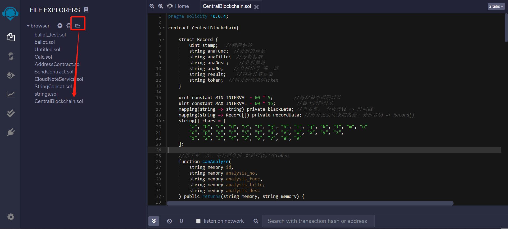

2. [安装 MetaMask的Chrome扩展](https://metamask.io/download.html)，并在其上注册一个 Ropsten 测试链上的账号

3. 回到 remix-ide，点击`DEPOLY & RUN TRANSACTIONS`，选择部署环境为 `Injected Web3` 

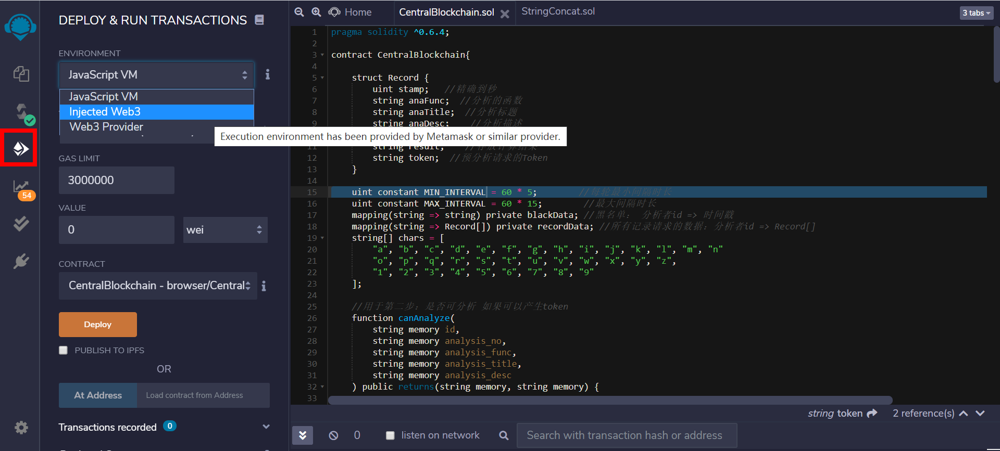

4. 此时会弹出MetaMask扩展的授权，remix-ide 要求得到你在 Ropsten网络上某账号的授权。点击“连线”，即可。

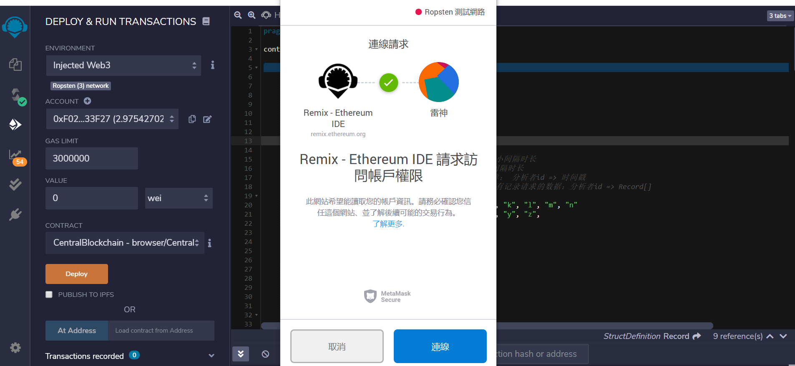

5. 连线完成后，点击上图橘色按钮`Deploy` ，这是MetaMask又会弹框，告知你部署需要的多少以太。若以太不够，由于Ropsten是测试网络，你可以在MetaMask插件上，点击“存入 - 取得以太币 - request 1 ether from faucet”（如下三图所示），免费获得以太币。同样，获得以太币需要等待一段时间。

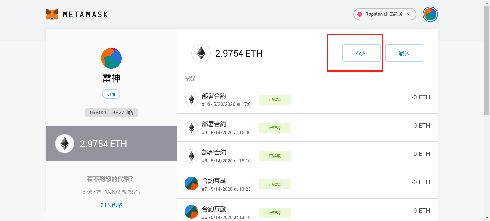

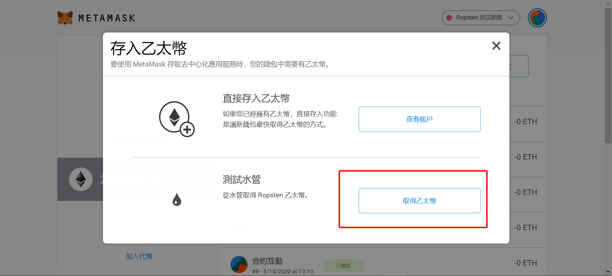

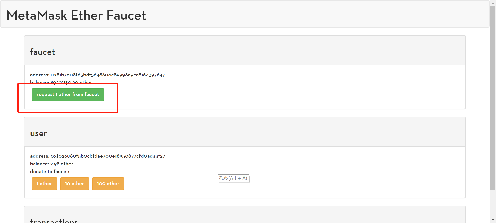

6. 回到点击"Deploy"后，MetaMask弹出的通知，点击“确认”后，就会对合约进行部署。同样地，这一步也需要一段时间。

7. 部署成功后，MetaMask会弹出通知，告知你合约部署完成，同时remix-ide左下角上也会展示合约地址，如下图所示。该合约地址，请妥善保存。

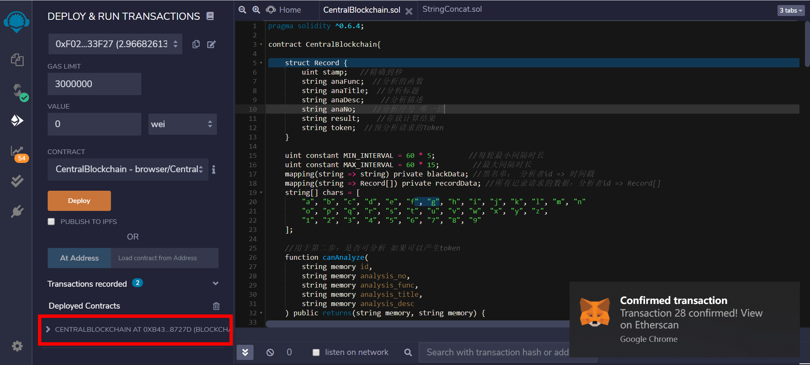

8. 安装 solc，在任意文件夹下打开cmd终端，输入 `npm install -g solc`。 solc模块用于编译Solidity文件。

9. 在 cb-privacy/contracts文件夹下，打开cmd终端，输入 `solcjs --abi xxxxx.sol` ，将智能合约转成abi文件，abi文件用于让终端调用智能合约接口时，能知道该合约有哪些曝露的接口。其中xxxxx，为你的智能合约名，比如 `CentralBlockchain.sol` 。生成完后，会在同目录下出现 xxxxx_sol_xxxxx.abi 文件

10. 将 xxxxx_sol_xxxxx.abi 复制到 cb-privacy/main-project/cloudfunctions/cb 文件夹下，并修改该文件夹下Controller.js 代码的定义: 将合约地址改成第 7步得到的地址，将 .abi 文件修改至正确的路径下，以及修改成自己在Ropsten链上的账户地址，如下图所示。小提示：`./CentralBlockchain_sol_CentralBlockchain.abi` 中 “./” 代表在当前文件夹下的意思。

11. 另外，你有可以至 [infura.io](https://infura.io/) 注册一个账户，其提供套件，可视为一个节点，来便利的连接以太坊网络。在其控制台上，点击`CREATE NEW PROJECT` 即可创建一个项目。

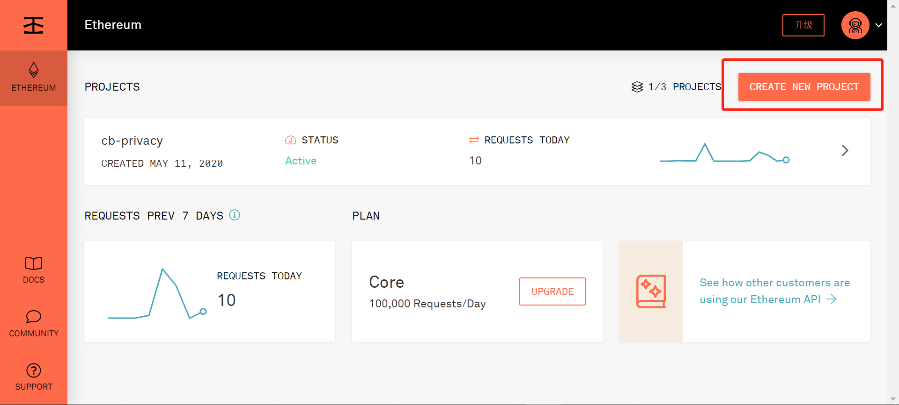

12. 创建成功后，即会得到以太坊上各个网络的一个地址，其将作为一个连接以太坊的端点，如此你即可在终端里使用该网址来调用智能合约。

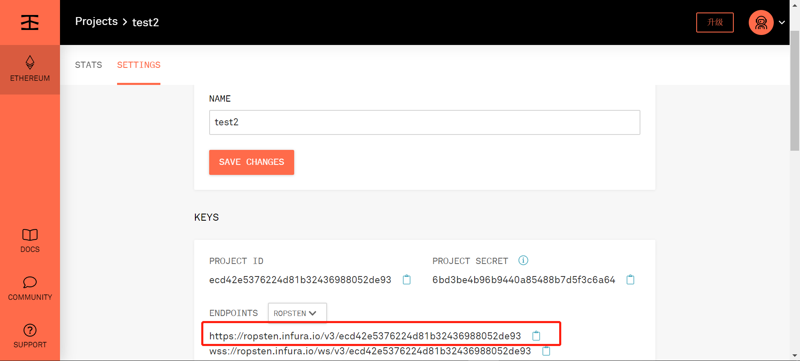

13. 将该地址复制到 cb云函数下的 Controller.js 文件中的 u变量里。之后，调用智能合约时，即会通过该地址进行连接。

### :phone: 联系

若对以上有任何疑问，欢迎提issue，或联系 yenche123@sjtu.edu.cn，感谢你的支持！

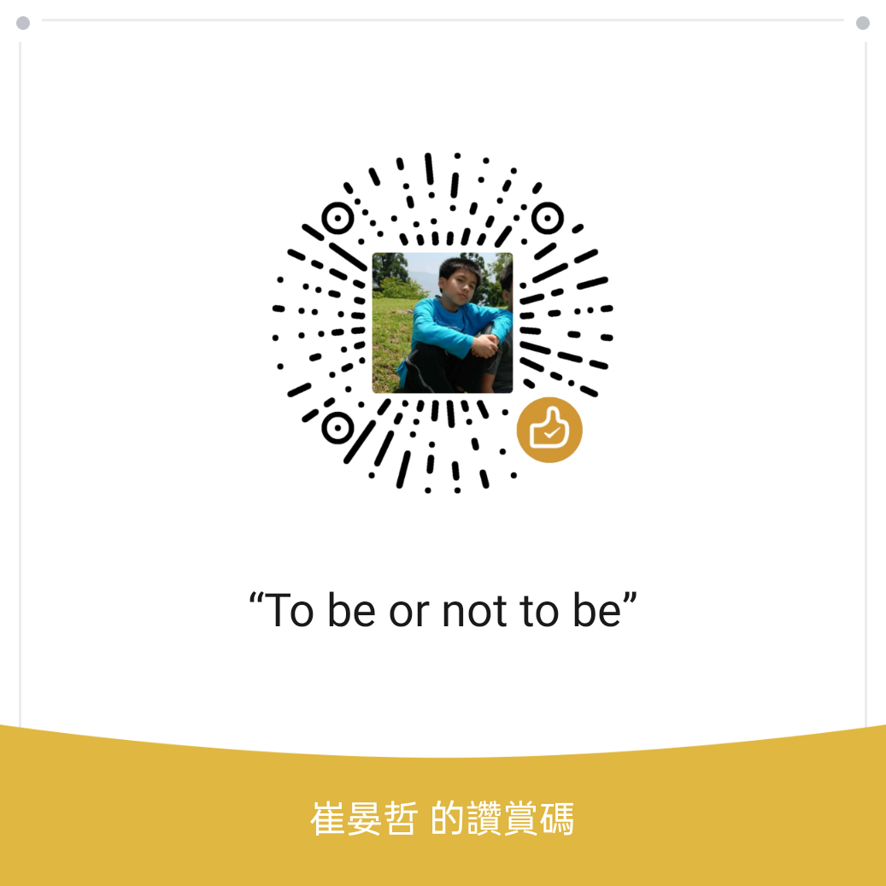

